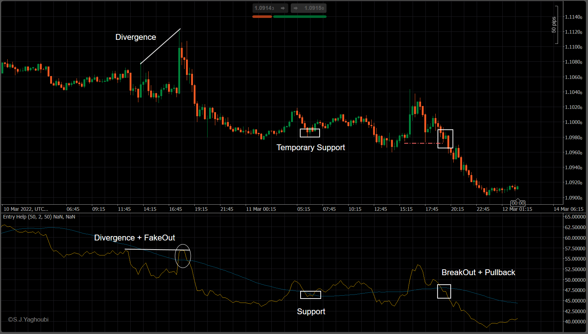

# EntryHelp (entry trigger)

Art is in simplicity!

This is a very simple and handy tool that can be a strong, fast, and loyal companion when you want to enter a position and looking for a trigger.

The tool consists of RSI, one-step smoothing, and SMA and can be used for exploring Divergence, FakeOut, Support, and Resistance.

# Installation
Just copy the indicator(Entry Help.algo) from Compiled Directory to your PC and double-click on it. It will install automatically on your Ctrader-Platform. You can also download it directly from the Ctrader network:

<a href="https://ctrader.com/algos/indicators/show/2966" title="EntryHelp">Ctrader Developer Network</a>

